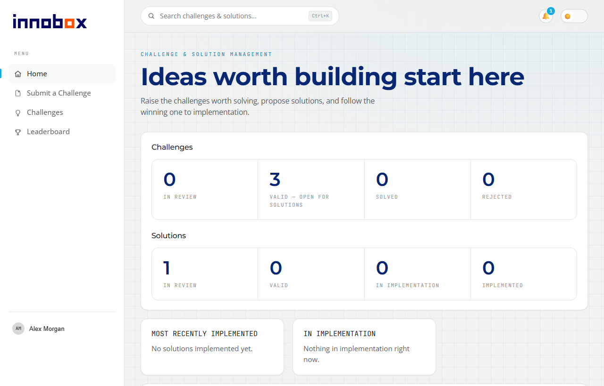
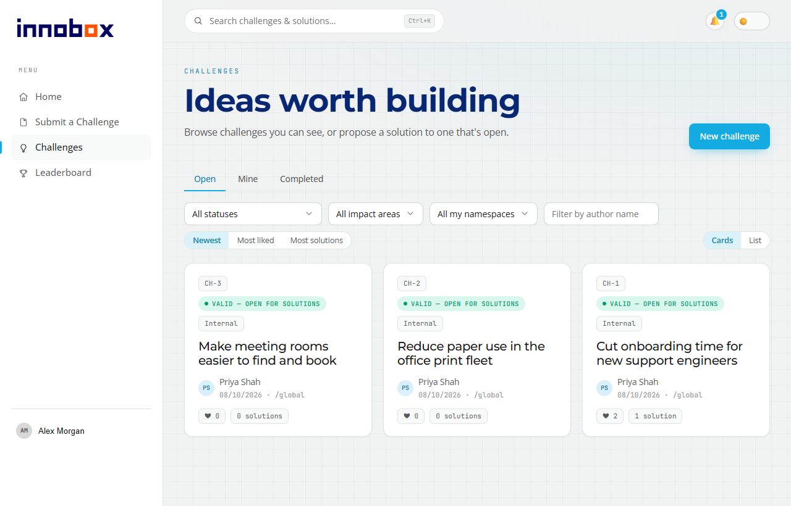

# InnoBox

**InnoBox** — a self-hosted challenge & solution platform that turns the problems your
people run into every day into a governed pipeline of ideas, decisions and delivered
improvements. Anyone can raise a challenge, anyone can propose a fix, and a review
committee drives the best one all the way to implementation — in the open, on the
record, and inside your own network.

- **Every good idea gets a path, not a void.** Today, improvement ideas die in
  hallway conversations, inboxes and suggestion boxes nobody empties. In InnoBox every
  challenge enters a visible lifecycle — triage, review, validation, solutions,
  implementation — so the person who raised it can always see where it stands, and
  nothing quietly disappears.
- **One winner, enforced.** Colleagues compete with solutions on a validated
  challenge; the committee picks exactly one. Implementing it solves the challenge and
  closes the alternatives automatically. No duplicated effort, no ambiguity about what
  was decided.
- **Speak up without the politics.** Submit anonymously and your name is hidden
  everywhere — lists, search, exports, e-mails, notifications — enforced at the API,
  not just the UI. Identity is revealed only through an audited admin action, or by you
  when you choose to step forward.
- **Real process, not a free-for-all.** Enforced state machines govern every
  transition for committee members and assignees; admins can override, and every move
  is recorded as *from → to*, with who made it.
- **Built for the whole organization, sliced by team.** Namespaces give each business
  unit its own triage, committee and admins. A challenge restricted to a namespace never
  leaks — not through search, autocomplete, counts, KPIs, leaderboards or
  notifications.
- **Identity you already trust.** Microsoft Entra ID sign-in, SCIM 2.0 provisioning and
  group-based roles: joiners get access on day one, movers' permissions follow their
  groups, and leavers are deactivated the moment Entra says so. GDPR erasure — with
  hand-over of open assignments — is one audited action.
- **A tamper-evident record.** Every governance action lands in an append-only,
  hash-chained audit log that admins can browse, filter, export and **verify** end to
  end. Audits stop being archaeology.
- **People actually come back.** Likes, comments, follows, a notification inbox, e-mail
  through your own Microsoft 365 mailbox, per-event preferences, "new since your last
  visit" markers, featured challenges on Home, a contributor leaderboard, and channel
  webhooks that post status changes straight into Teams.
- **Admins see everything they need.** A triage queue with bulk actions and CSV export,
  an attention badge for what's new in it, who's online right now, a system banner, a
  system log of every server error, and identity-sync diagnostics for when Entra and
  InnoBox disagree.
- **Safe by default.** Attachments are virus-scanned by ClamAV and served only through an
  authenticated gateway; a nonce-based Content-Security-Policy, CSRF checks and per-user
  rate limits are on out of the box; a development sign-in bypass physically refuses to
  start in a production build.
- **Yours, entirely.** Self-hosted with Docker Compose, Apache-2.0, no telemetry, no
  external service in the request path except your own Entra tenant.





## How it works

```
 raise a challenge ──► awaiting triage ──► in review ──► valid ──► solutions proposed
                                │              │           │              │
                                ▼              ▼           │              ▼
                       rejected/withdrawn  needs improvement│      one solution is
                                         / meeting with     │      implemented ──► challenge solved,
                                           the author       │                      the others closed
```

1. **Anyone signed in** submits a challenge — optionally anonymous, optionally restricted
   to their namespace — and gets a warning if it looks like one that already exists.
2. **Namespace admins** triage it; the **review committee** moves it through review.
3. Once **valid**, anyone who can see it proposes solutions, with cost vs. benefits and
   attachments.
4. The committee validates solutions; implementing one **solves the challenge** and
   closes its siblings. Everyone following along is notified at every step.

---

## Before you start: prerequisites

InnoBox is enterprise software with real infrastructure dependencies, and it is honest
about them. **There is no demo or evaluation mode, and a deployment cannot run without a
Microsoft Entra ID tenant** — a deliberate decision, not an omission (see
[INNOBOX_SPEC.md](INNOBOX_SPEC.md) §19). If you were hoping to `docker compose up` and
click around a sandbox, this is not that project.

| You need | Why |
|---|---|
| **A Microsoft Entra ID tenant** | An app registration for OIDC sign-in and an Enterprise Application for SCIM provisioning. Roles resolve from SCIM-synced group membership — never from token claims — so provisioning is required, not optional. |
| **Docker + Docker Compose** | The reference deployment is the compose stack in [`deploy/`](deploy/). |
| **PostgreSQL 16** | Bundled in the stack. Migrations are plain SQL in [`db/migrations/`](db/migrations/), applied automatically. |
| **S3-compatible object storage** | Attachments. MinIO is bundled; point it at real S3 if you prefer. |
| **ClamAV** | Bundled. Attachments are served only after a clean scan. |
| **A TLS-terminating reverse proxy** | Yours. The stack serves plain HTTP on `:8080` behind it. |
| **A Microsoft 365 service mailbox** *(optional)* | Outbound e-mail through Microsoft Graph. Without it (or the SMTP fallback), the in-app inbox still works. |

---

## Run it (self-hosted)

### 1. Configure `deploy/.env`

```bash
cp deploy/.env.example deploy/.env
```

Every value is documented inline in [`deploy/.env.example`](deploy/.env.example). Replace
**every** placeholder (`change-me…`, `generate-…`, all-zero GUIDs) — none is a safe
default — and never commit `deploy/.env`. **No deployment-specific value lives in this
repository**, so there is nothing of ours to un-configure.

**Required.** Variables marked ⛔ are enforced by the compose file, so
`docker compose up` refuses to run while they are empty.

| Variable | Purpose |
|---|---|
| `PUBLIC_BASE_URL` | Your InnoBox's external HTTPS URL, no trailing slash. Used for OIDC redirects and links in e-mails. |
| `POSTGRES_PASSWORD` ⛔ · `POSTGRES_USER` · `POSTGRES_DB` | The Postgres superuser, used by `postgres` and `migrate` only. |
| `INNOBOX_APP_PASSWORD` ⛔ | Password of the least-privilege `innobox_app` role that web and worker connect as. |
| `NEXTAUTH_SECRET` ⛔ | Session signing secret — `openssl rand -base64 32`. Rotating it signs everyone out. |
| `ENTRA_TENANT_ID` · `ENTRA_CLIENT_ID` · `ENTRA_CLIENT_SECRET` | The Entra app registration for sign-in (and the worker's Graph reconciliation). See step 2. |
| `INNOBOX_BOOTSTRAP_ADMIN_GROUP` | An Entra **group object id** whose members are Platform Admins from first boot, before any role mapping exists. |
| `SCIM_BEARER_TOKEN` ⛔ | The secret Entra presents to `/scim/v2` — at least 32 characters, e.g. `openssl rand -base64 48`. |
| `MINIO_ROOT_PASSWORD` ⛔ · `MINIO_ROOT_USER` · `S3_BUCKET` | Bundled MinIO credentials and the attachment bucket (created on first use). |

**Optional** — leave unset to keep the default or keep the feature off.

| Variable | Purpose |
|---|---|
| `EMAIL_TOKEN_ENC_KEY` · `ENTRA_EMAIL_CLIENT_ID` · `ENTRA_EMAIL_CLIENT_SECRET` | Graph e-mail through a service mailbox, using a **separate** Entra app registration. |
| `SMTP_HOST` · `SMTP_PORT` · `SMTP_SECURE` · `SMTP_USER` · `SMTP_PASSWORD` · `SMTP_FROM` | The plain-text SMTP fallback for e-mail. |
| `WEBHOOK_ENC_KEY` | Turns on per-namespace channel webhooks (Teams Workflows or any JSON receiver). |
| `CSP_MODE` | `enforce` (default) or `report-only` while you roll out a policy change. |
| `METRICS_TOKEN` | Protects `/metrics` with a bearer token. Without it, production disables `/metrics`. |
| `TRUST_PROXY` | How many proxy hops to trust for the real client IP (`1` for the bundled proxy). |
| `PROXY_MAX_BODY_SIZE` | The proxy's request-body cap (default `201MiB`, the largest upload plus 1 MiB). |

### 2. Set up Microsoft Entra ID

The full walkthrough, with every permission and its reason, is in
[`ENTRA_AUTH_SPEC.md`](ENTRA_AUTH_SPEC.md). In short:

- **Sign-in** — register an app with the Web redirect URI
  `<PUBLIC_BASE_URL>/api/auth/callback/azure-ad`; put its tenant id, client id and secret
  into `ENTRA_*`.
- **Provisioning** — in the Enterprise Application → *Provisioning*, set the tenant URL to
  `<PUBLIC_BASE_URL>/scim/v2` and the secret token to `SCIM_BEARER_TOKEN`, then assign the
  groups you want synced.
- **Reconciliation** *(recommended)* — grant the sign-in app the Graph application
  permissions `User.Read.All` and `GroupMember.Read.All` with admin consent; the worker
  then keeps directory profiles and memberships fresh.
- **Bootstrap** — set `INNOBOX_BOOTSTRAP_ADMIN_GROUP`; its members sign in as Platform
  Admins and create namespaces and role mappings from the Administration console.
- **E-mail** *(optional)* — a second app registration with delegated `Mail.Send` +
  `offline_access`, assignment required, only the service mailbox assigned, redirect URI
  `<PUBLIC_BASE_URL>/api/admin/email/callback`; then connect the mailbox from
  *Administration → Settings*.

### 3. Bring it up

```bash
docker compose -f deploy/docker-compose.yml up -d --build
```

The stack is **postgres · migrate · minio · clamav · web · worker · proxy**. The `migrate`
service applies every migration in order and exits 0 when done. Point your
TLS-terminating proxy at port `8080`; the bundled Caddy routes `/scim/*` to the worker and
everything else to the web app.

### 4. Operate it

- **Back up** the Postgres and MinIO volumes (`deploy/data/`).
- **Health:** `GET /healthz` (liveness) and `GET /readyz` (database check).
- **Metrics:** Prometheus text at `/metrics` on web and worker.
- **Logs:** structured JSON on stdout; server errors also land in the in-app system log.
- **Scaling:** the web app is stateless; the worker elects a leader through a Postgres
  advisory lock, so only one instance runs the sweeps.

---

## Hack on it locally (developers)

This loop is for **working on the code**, not for evaluating the product: it signs you in
with a development bypass instead of Entra. The bypass needs `INNOBOX_DEV_AUTH=1` **and**
a non-production build — a production build that finds the flag set refuses to start.

You need **Node 24 LTS** and **pnpm 9.15.x** (`corepack enable pnpm`), plus Docker for the
backing services.

```bash
pnpm install
```

```bash
cp deploy/.env.example deploy/.env
```

Fill in at least the ⛔ values, then start the backing services and apply the migrations:

```bash
docker compose -f deploy/docker-compose.yml up -d postgres minio clamav migrate
```

Create **`packages/web/.env.local`** (gitignored):

```ini
DATABASE_URL=postgres://innobox_app:<INNOBOX_APP_PASSWORD>@127.0.0.1:5432/innobox
NEXTAUTH_URL=http://localhost:3000
NEXTAUTH_SECRET=dev-only-secret
PUBLIC_BASE_URL=http://localhost:3000
INNOBOX_DEV_AUTH=1
```

Then run everything with hot reload:

```bash
pnpm dev
```

Open <http://localhost:3000> and use the **Dev sign-in** panel on the landing page. A
display name is enough; set the admin field to `1` to sign in as a Platform Admin. Each
distinct name is its own user, so you can play several roles side by side. To try
attachments locally, the web app also needs to reach MinIO's S3 port (`9000`), which the
compose file does not publish by default — publish it in a local override and set
`S3_ENDPOINT`.

> **Windows:** if real-time Defender scanning quarantines files under `node_modules`
> (symptoms: `MODULE_NOT_FOUND`, a missing `next` binary), add a Defender exclusion for
> the clone's `node_modules` and the pnpm store, then run `pnpm install --force`.

### Tests

```bash
pnpm typecheck
```

```bash
pnpm test
```

```bash
pnpm test:db
```

```bash
pnpm --filter @innobox/web e2e
```

- `pnpm typecheck`, `pnpm lint`, `pnpm test` and `pnpm build` run across the whole
  workspace (`@innobox/shared`, `@innobox/web`, `@innobox/worker`); `pnpm test` is
  hermetic and needs no Docker.
- `pnpm test:db` runs the database integration suites against a **throwaway database**
  it creates, migrates and drops on every run — it needs the compose Postgres up and
  reads its connection details from `deploy/.env` and `packages/web/.env.local`.
- The Playwright end-to-end suite starts the dev server itself (with the dev sign-in)
  unless `E2E_NO_WEBSERVER=1`; run `npx playwright install` once first.

CI runs all of it on every push (GitHub Actions).

---

## How it is built

| Document | What it covers |
|---|---|
| [`INNOBOX_SPEC.md`](INNOBOX_SPEC.md) | **The authoritative specification.** Every behavior is specified there first and implemented second. Start here to understand what InnoBox does and why. |
| [`ENTRA_AUTH_SPEC.md`](ENTRA_AUTH_SPEC.md) | The identity integration in detail — OIDC sign-in, the SCIM 2.0 server, RBAC resolution, and the Entra dialect quirks that matter. |
| [`CLAUDE.md`](CLAUDE.md) | The working context: the non-negotiable invariants, the gated spec-first workflow, the release ritual, and commit conventions. |
| [`db/migrations/README.md`](db/migrations/README.md) | Migration conventions, the append-only audit trigger, and the least-privilege app role. |

```
packages/
  web/        Next.js app — UI, REST API, OIDC sign-in (Auth.js + Entra)
  worker/     SCIM 2.0 server, Entra reconciliation, virus-scan / e-mail / webhook sweeps (leader-elected)
  shared/     domain types, RBAC, state machines, validation, the e-mail engine
db/migrations/  plain-SQL migrations, applied in order by the migrate service
deploy/         docker-compose, .env.example, Caddyfile
```

A few invariants explain choices that otherwise look strange:

- **Roles never come from OIDC token claims** — only from SCIM-synced group membership.
  Entra silently drops the `groups` claim past ~200 groups; a claim-based design fails in
  exactly the large tenants it needs to work in.
- **Anonymity is enforced at the API layer, everywhere** — lists, details, search,
  exports, e-mails, notifications. True identity surfaces only through an audited reveal.
- **Visibility filtering is total.** A namespace-restricted challenge must not leak
  through lists, search, autocomplete, counts, KPIs, leaderboards or notifications.
- **The audit log is append-only**, enforced by database grants and a trigger, and
  hash-chained so tampering is detectable.
- **Attachments are served only through the authenticated gateway**, and only after a
  clean virus scan.

---

## Trademark

**The Apache-2.0 grant covers the code. It does not cover names, logos, or brand.**
Apache-2.0 §6 grants no permission to use the licensor's trade names, trademarks, or
product names beyond reasonable and customary use in describing the origin of the work,
and none are granted here: the creating organization's name and logo, and the InnoBox
wordmark and mark, remain theirs. You may run, modify, and redistribute the software
freely — but not present your version as the original or imply it is endorsed by them.

The brand ships as the default look, and the codebase is deliberately arranged so you
can strip it. **To rebrand a fork, edit these and nothing else:**

1. `packages/web/src/components/AppShell.tsx` — the sidebar colophon attribution line.
2. `packages/web/e2e/discovery.spec.ts` — the e2e assertion that the line renders.
3. `packages/web/src/lib/attribution.test.ts` — the hygiene test that enforces the
   above two. It is meaningless in a fork; delete it.
4. `packages/web/public/brand/` and `packages/web/src/app/icon.svg` — the wordmark, its
   light/dark variants, the social-share card, and the browser icon.
5. `packages/web/src/app/globals.css` — the design tokens, if you are replacing the
   palette too. The token table in [`INNOBOX_SPEC.md`](INNOBOX_SPEC.md) §2.2 documents
   what each one does.

That list is exhaustive by design, and a test keeps it that way: the organization's
name may not appear anywhere else in `packages/**`.

## Licence

Apache-2.0 — see [LICENSE](LICENSE) and [NOTICE](NOTICE).

## Versioning

The product version is **`APP_VERSION`** in
[`packages/shared/src/version.ts`](packages/shared/src/version.ts), shown in the
sidebar colophon and on the in-app **What's new** page, which lists every release. The
`version` fields in the `package.json` files are deliberately left at `0.0.0` — the
packages are not published to any registry. If you are reporting a bug, the number in
the sidebar is the one worth quoting.

## Contributing, security, support

- **Pull requests are not accepted** and are closed automatically. This is not a
  judgement on your patch — see [CONTRIBUTING.md](CONTRIBUTING.md) for the reasoning.
  Forking is welcome: that is what the licence is for.
- **Issues are welcome and are read.** Bug reports, deployment problems, documentation
  gaps, and questions all help.
- **Security vulnerabilities**: do not open a public issue. Use GitHub's private
  vulnerability reporting — see [SECURITY.md](SECURITY.md).
- **Support**: InnoBox is provided **as-is**. Issues are read, but no response time is
  promised and there is no support commitment. Plan accordingly if you intend to run it.
- Participation is governed by the [Code of Conduct](CODE_OF_CONDUCT.md).
